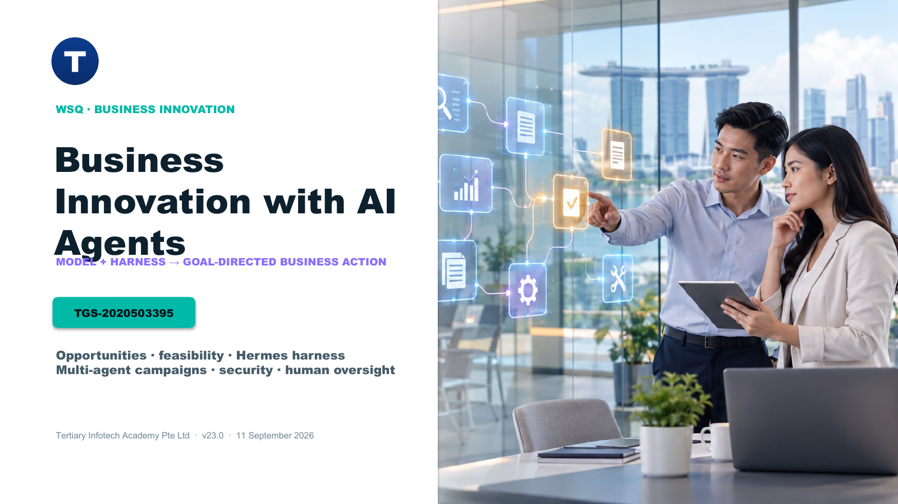

<div align="center">

# Business Innovation with AI Agents

[](https://www.tertiarycourses.com.sg/wsq-business-innovation-with-ai-agents.html)
[](courseware/Business-Innovation-with-AI-Agents-v23.0.pdf)
[](labs/)

**A one-day WSQ course on finding, designing and governing valuable AI-agent opportunities with Hermes Agent.**

[Official course page](https://www.tertiarycourses.com.sg/wsq-business-innovation-with-ai-agents.html) · [Learner Guide](LG-Business-Innovation-with-AI-Agents.md) · [Labs](labs/)

</div>

## Course preview



## What learners build

- A clear comparison of prompt, context, harness and agent engineering from 2023 to 2026.
- A model-plus-harness architecture mapped against the human brain-plus-body analogy.
- A scored opportunity portfolio covering ten realistic use cases across multiple industries.
- A safe Hermes Agent setup using bounded tools, context, memory, skills and subagents.
- Review-ready multi-agent marketing and video campaign packages.
- Security, data-governance, human-in-the-loop and release-control evidence.

## Course structure

| Topic | Focus | Labs |
|---|---|---|
| 1 | AI engineering evolution and agent architecture | 1–2 |
| 2 | Business opportunities, feasibility and cost-benefit | 6 |
| 3 | Hermes Agent harness in practice | 1, 3–4 |
| 4 | Multi-agent campaign orchestration | 5, 7 |
| 5 | Security, governance and implementation | 8 |

## Learning resources

- `courseware/Business-Innovation-with-AI-Agents-v23.0.pptx` — editable, highly visual presentation.
- `courseware/Business-Innovation-with-AI-Agents-v23.0.pdf` — learner presentation PDF.
- `courseware/LG-Business-Innovation-with-AI-Agents.docx` and PDF — detailed concepts, procedures and troubleshooting.
- `courseware/LP-Business-Innovation-with-AI-Agents.docx` and PDF — one-day schedule and alignment map.
- `labs/lab-01-*` through `labs/lab-08-*` — standalone lab packs with mock inputs, evidence checklists, verification and cleanup.

## Hermes Agent setup

Use the current official installation path documented by Nous Research:

```bash
curl -fsSL https://hermes-agent.nousresearch.com/install.sh | bash
```

Then follow Lab 1. Keep API keys in a local environment file, use fictional data, and never commit credentials or private evidence.

## Repository boundary

This public repository is learner-safe. Assessment answer keys, trainer-only material, local build sources, reference ebooks, credentials and `.env` files are intentionally excluded.

## Developed by

[Tertiary Infotech Academy Pte Ltd](https://www.tertiarycourses.com.sg/) · UEN 201200696W

Hermes Agent is maintained by [Nous Research](https://github.com/NousResearch/hermes-agent). Reference ebooks informed the teaching synthesis; their copyrighted files are not redistributed here.
